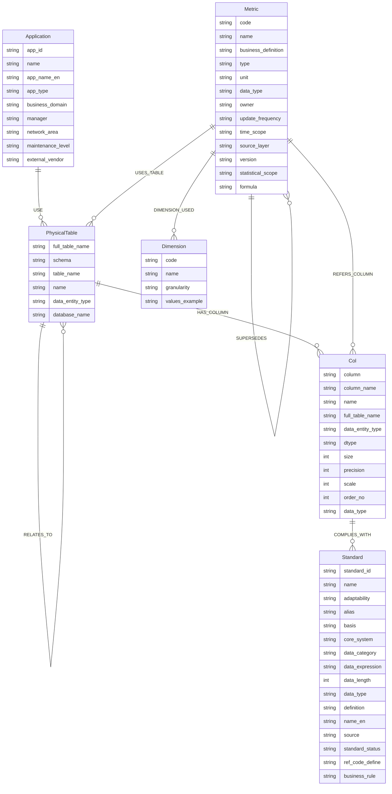

# Govio 图数据库本体模型

## 关系说明

| 关系 | 源节点 | 目标节点 | 属性 |
|------|--------|----------|------|
| HAS_COLUMN | PhysicalTable | Col | - |
| RELATES_TO | PhysicalTable | PhysicalTable | relationship_type, description, source_columns, target_columns |
| USE | Application | PhysicalTable | - |
| COMPLIES_WITH | Col | Standard | - |
| USES_TABLE | Metric | PhysicalTable | - |
| REFERS_COLUMN | Metric | Col | role |
| DIMENSION_USED | Metric | Dimension | usage_type |
| DERIVED_FROM | Metric | Metric | - |
| SUPERSEDES | Metric | Metric | - |
