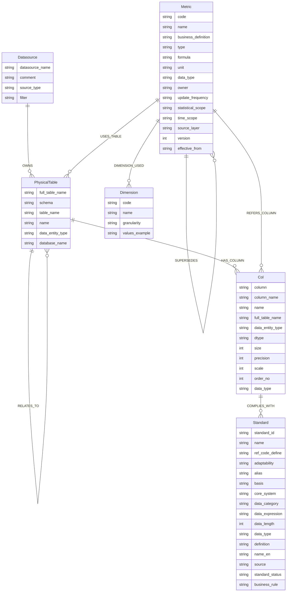

# Govio 图数据库本体模型

```mermaid
erDiagram
    PhysicalTable {
        string full_table_name
        string schema
        string table_name
        string name
        string data_entity_type
        string database_name
    }

    Col {
        string column
        string column_name
        string name
        string full_table_name
        string data_entity_type
        string dtype
        int size
        int precision
        int scale
        int order_no
        string data_type
    }

    Datasource {
        string datasource_name
        string comment
        string source_type
        string filter
    }

    Standard {
        string standard_id
        string name
        string ref_code_define
        string adaptability
        string alias
        string basis
        string core_system
        string data_category
        string data_expression
        int data_length
        string data_type
        string definition
        string name_en
        string source
        string standard_status
        string business_rule
    }

    Metric {
        string code
        string name
        string business_definition
        string type
        string formula
        string unit
        string data_type
        string owner
        string update_frequency
        string statistical_scope
        string time_scope
        string source_layer
        int version
        string effective_from
    }

    Dimension {
        string code
        string name
        string granularity
        string values_example
    }

    Datasource ||--o{ PhysicalTable : "OWNS"
    PhysicalTable ||--o{ Col : "HAS_COLUMN"
    PhysicalTable ||--o{ PhysicalTable : "RELATES_TO"
    Col ||--o{ Standard : "COMPLIES_WITH"
    Metric ||--o{ PhysicalTable : "USES_TABLE"
    Metric ||--o{ Col : "REFERS_COLUMN"
    Metric ||--o{ Dimension : "DIMENSION_USED"
    Metric ||--o{ Metric : "DERIVED_FROM"
    Metric ||--o{ Metric : "SUPERSEDES"
```

## 关系说明

| 关系 | 源节点 | 目标节点 | 属性 |
|------|--------|----------|------|
| OWNS | Datasource | PhysicalTable | - |
| HAS_COLUMN | PhysicalTable | Col | - |
| RELATES_TO | PhysicalTable | PhysicalTable | relationship_type, description, source_columns, target_columns |
| COMPLIES_WITH | Col | Standard | - |
| USES_TABLE | Metric | PhysicalTable | - |
| REFERS_COLUMN | Metric | Col | role |
| DIMENSION_USED | Metric | Dimension | usage_type |
| DERIVED_FROM | Metric | Metric | - |
| SUPERSEDES | Metric | Metric | change_description |

## 说明

- 全部标识带数据源前缀：表 `datasource_name.schema.table`，列 `datasource_name.schema.table.column`；节点 ID 为确定性 10 位字符串，详见 `docs/specs/data-model.md`
- `Standard` 除 `standard_id` / `name` 外的属性列由 META_ATTR 动态 pivot 生成（`code` 列重命名为 `ref_code_define`），上图所列为常见取值，实际列随属性定义变化
- `OWNS` 为治理归属：每张 `PhysicalTable` 恰好被一个 `Datasource` 拥有（`meta meta` 生成）
- 保留规划中（尚未实现）：节点 `Calculation`，关系 `CALCULATED_BY`、`BASED_ON`
