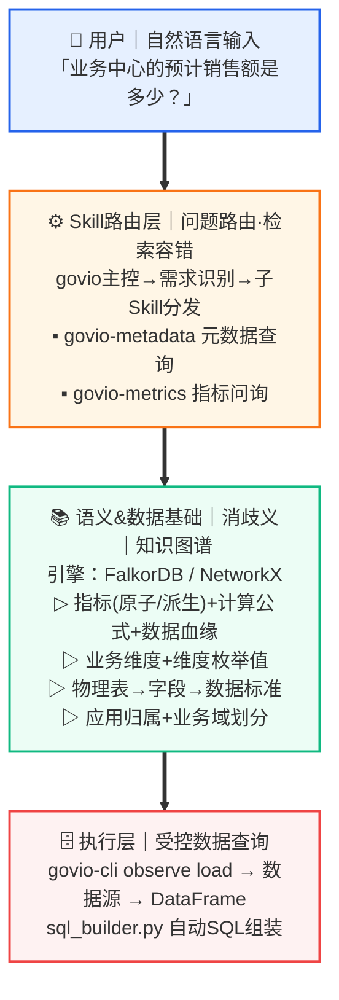

# 自助数据分析的关键不是 Text-to-SQL，而是语义治理

> 受 Anthropic 文章 *How Anthropic enables self-service data analytics with Claude* 启发，本文介绍 Govio 如何在企业数据治理场景中实现类似的自助数据分析能力。
> 
> **Govio 不是 Text-to-SQL 工具，而是面向企业语义治理的 Agent 执行框架。** 它的目标不是让 AI 学会自由查数，而是让 AI **只能沿着被治理过的语义路径查数**。

---

## 背景：数据治理的自助分析困境

传统的企业数据治理面临两难：

- **放权给业务方**：随着业务扩展，大量宽表和去规范化视图堆积，定义不一致，口径冲突频发。而业务人员往往既不想学 SQL，也搞不清"账单收入"到底取哪张表的哪个字段。
- **集中管控**：数据团队包揽所有取数需求，响应慢、需求长尾覆盖不到，指标和看板越建越臃肿。

LLM 的出现提供了第三条路——让 AI Agent 代替人去查询、分析和回答数据问题。但直接让 LLM 对接数据仓库，往往会制造"看起来对、实际上错"的假象。

Govio 正是在这个背景下诞生的：**让 AI Agent 基于受治理的元数据和语义层，在安全边界内完成自助数据分析，把数据团队从重复取数中解放出来，聚焦因果建模、预测和策略分析等高价值工作。**

这三句话界定了 Govio 的核心立场：

- **自助不是放任，而是在规则内放权。** Agent 可以自主完成查询，但只能在被治理定义过的语义路径上行动。
- **语义层不是文档，而是组织裁决的可执行形态。** 知识图谱中每一个指标定义、每一条血缘关系，背后都是组织经过标准制定、口径裁决、责任归属后确认下来的治理结果。
- **Agent 不是替代数据治理，而是把治理规则执行到每一次问数里。** 过去治理规则写在文档里、存在人脑里，现在它们被编码为 Agent 的强制执行路径。

---

## 核心问题：为什么数据分析不是代码生成问题

与编码 Agent 不同，数据分析 Agent 面对的是一个**通常只有一个正确答案、却没有确定性验证手段**的问题空间。代码有测试和编译器兜底，数据分析的正确性却高度依赖上下文。

Anthropic 总结了三个主要失败模式，Govio 的设计也直面了同样的挑战：

| 失败模式     | 表现                                       | Govio 的应对                            |
| -------- | ---------------------------------------- | ------------------------------------ |
| **概念歧义** | 用户说"销售额"，可能是"账单收入"也可能是"签约额"；成百上千个字段中选错一个 | 语义层 + 指标索引收窄到唯一答案                    |
| **数据过时** | 业务定义、表结构持续变化，元数据和 Agent 知识迅速腐化           | Skill 文档与数据模型同仓管理、eval 驱动的持续验证       |
| **检索失败** | 正确信息存在但搜索空间太大，Agent 找不到                  | Skill 路由 + 领域参考文档，将搜索空间从百万字段压缩到几十个文件 |

---

## Govio 的自助分析架构

Govio 采用分层架构，每一层专门解决上述一个或多个失败模式：



---

## 第一层：数据基础——从源头消除歧义

### 创建规范数据集，收窄搜索空间

Govio 的知识图谱存储了完整的元数据模型：

- **Application**：15 个业务应用（AEP 会计引擎、SQC 报价单中心、PAYPRO 薪税系统......）
- **PhysicalTable -> Col**：1,300+ 张物理表及其字段，通过 `HAS_COLUMN` 关系关联
- **Metric（指标）**：分为原子指标（直接取自 DWS 汇总层）和派生指标（由原子指标计算得出），每个指标明确声明来源表、引用列、可用维度
- **Dimension（维度）**：标准化的业务维度（sales_unit 事业部、sales_dept 业务中心......）
- **Standard（数据标准）**：字段级的数据标准合规关系

这种结构化建模确保：当用户问"账单收入"时，Agent 在图谱中只找到**一个**治理过的指标定义 `bill_income_amt`，指向唯一的来源表 `dws.income_bill_monthly`，而不是四十个口径各异的候选。

需要强调的是，这种"唯一性"不是天然存在的，而是治理过程制造出来的。指标的唯一正确答案，是组织通过标准制定、口径裁决、责任归属和版本控制，将某个定义确认为当前有效的治理结果。知识图谱承载的是裁决结果，而不是替代裁决过程。Govio 的价值在于：把组织已经完成的治理裁决，编码为 Agent 可执行的结构化路径——让每一次问数都自动沿着被确认过的口径走，而不是重新发明口径。

### 将元数据作为一等公民

Anthropic 提到，"仓库应该像代码库一样可读"。Govio 通过知识图谱做到了这一点：

- 每个指标有**业务定义**（`business_definition`）、**统计范围**（`statistical_scope`）、**时间范围**（`time_scope`）
- 指标之间的**血缘关系**（`DERIVED_FROM`）和**替代关系**（`SUPERSEDES`）被显式建模
- 字段与**数据标准**的合规关系（`COMPLIES_WITH`）提供额外语义

这些元数据不是事后补充的文档，而是与数据模型共存于同一图谱中的结构化实体。

---

## 第二层：语义层——Agent 的首选查询路径

Anthropic 强调"语义层是 Agent 的**强制默认路径**"。Govio 的设计完全遵循这一原则。

### 指标语义层的工作方式

```
用户: "本月账单收入是多少"

Step 1  -> 读取 metrics_index.md，匹配指标编码 bill_income_amt
Step 2  -> 查询知识图谱获取元数据：
           - 类型: 原子指标
           - 来源表: dws.income_bill_monthly
           - 引用列: bill_income_amt
           - 可用维度: sales_unit, sales_dept, biz_mode, ...
Step 3  -> sql_builder.py 组装 SQL
Step 4  -> govio-cli observe load 执行查询
Step 5  -> 格式化输出（含单位、时间范围）
```

### 原子指标 vs 派生指标

| 类型   | 查询方式               | 示例                                                                              |
| ---- | ------------------ | ------------------------------------------------------------------------------- |
| 原子指标 | 直接从来源表获取           | `bill_income_amt`（账单收入）-> `SELECT bill_income_amt FROM dws.income_bill_monthly` |
| 派生指标 | 通过 CTE 组合多个原子指标后计算 | `book_to_bill`（签约覆盖率）= `signed_amt / bill_income_amt`                           |

派生指标的血缘在图谱中被显式声明，Agent 通过 `DERIVED_FROM` 关系自动拆解查询，无需人工判断计算逻辑。

### 名称解析：中文到标准代码的映射

企业环境中，业务人员习惯用中文名（"报价单中心系统"、"薪税系统"），而数据层使用标准英文代码（SQC、PAYPRO）。Govio 在 Skill 层内置了名称映射机制：

- 用户输入含中文系统名时，Agent 先通过 Grep 搜索 `assets/names/` 目录
- 匹配到标准英文代码后再执行查询
- 支持模糊匹配和逐步放宽策略（精确 -> 包含 -> 同义词）

---

## 第三层：Skill 体系——Agent 的过程化知识

如果语义层是 Agent 的"声明式知识"（知道指标是什么），那 Skill 就是它的"过程化知识"（知道怎么一步步查）。

### 对偶 Skill 设计

Anthropic 提出"知识 Skill + 操作 Skill"的配对模式，Govio 的架构与之对应：

| Skill              | 角色       | 职责                                   |
| ------------------ | -------- | ------------------------------------ |
| **govio**（主控）      | 路由器      | 识别用户意图，分发到对应子 Skill                  |
| **govio-metadata** | 知识 Skill | 元数据查询：应用、表、字段、数据标准                   |
| **govio-metrics**  | 操作 Skill | 指标问数：解析指标 -> 查询元数据 -> 组装 SQL -> 执行查询 |
| **govio-observe**  | 操作 Skill | 数据探查：数据集加载、关系发现、数据比对                 |

### Playbook：常见场景的标准化流程

Govio 将高频查询场景封装为 Playbook，避免每次重新发明流程：

**Playbook: 单指标 + 维度过滤取数**

```
Step 0  读 schema（仅首次）
  |
Step 1  匹配指标编码（metrics_index.md）
  |
Step 2  查询指标元数据（来源表、实际列名、维度）
  |
Step 3  探查数据范围 + 维度值（不假设当前月份有数据）
  |
Step 4  组装 SQL（sql_builder.py）
  |
Step 5  执行查询（govio-cli observe load）
  |
Step 6  格式化输出（含单位、时间范围）
```

这个 Playbook 覆盖了"外滩业务中心的预计销售额"、"华东区本月账单收入"这类高频场景。类似地，多指标组合、环比分析、时间趋势等场景也有对应的查询模板。

### Skill 维护：与数据模型同仓

Anthropic 强调"Skill 文档描述的是一个每天都在变化的数据模型"。Govio 的应对策略：

- **Skill 文件与知识图谱数据同仓管理**：修改数据模型的 PR 同时更新对应的 Skill 文档
- **Eval 驱动的回归检测**：34 条测试提示词覆盖路由、元数据查询、指标问数、负向控制、边界情况 5 大类场景
- **查询终止策略**：同一语义目标最多 3 次尝试（精确 -> 模糊 -> 同义词），避免无限循环

---

## 第四层：验证体系——确保分析结果可信

### 离线评估（Offline Evals）

Govio 建立了结构化的评估框架，将"感觉更好"转化为可量化分数：

| 维度       | 检查项示例                                               | 量化方式        |
| -------- | --------------------------------------------------- | ----------- |
| **结果目标** | 查询返回正确结果、SQL 语义正确、指标数据准确                            | 与知识图谱原始数据比对 |
| **过程目标** | 首次读取 schema.md、使用 sql_builder.py、使用 govio-cli query | Trace 事件检查  |
| **风格目标** | Cypher 双引号、中文回答技术术语保留英文、结果含单位                       | 格式检查        |
| **效率目标** | 不重复读取 schema、无冗余命令、路由决策快速                           | 命令计数        |

测试提示词集按场景分类：

- **路由测试**（6 条）：验证主控 Skill 的意图识别和路由准确性
- **元数据查询**（8 条）：显式/隐式调用，覆盖应用、表、字段查询
- **指标问数**（12 条）：原子指标、派生指标、维度过滤、时间趋势
- **负向控制**（4 条）：确保不触发误匹配
- **边界情况**（4 条）：最小应用、非主流属性筛选、聚合排序

### 数据探查的受控访问

Govio 通过 `govio-observe` 的CLI架构设计实现了"能做什么"和"能看什么"的分离：

- **Skill 决定操作意图**：注册数据集、执行检核、比对分析
- **CLI决定数据可见性**：默认仅暴露统计摘要（行数、空值率、分布），原始数据访问需显式授权

这确保了 Agent 在分析过程中不需要接触原始敏感数据也能完成大部分治理任务。

---

## 从零开始的实践路径

如果你的数据团队想复用 Govio 的模式，以下是一个渐进式路径：

### 阶段一：最小可行版本

1. **选择一个业务域**（如销售），梳理该域的核心指标（5-10 个）
2. **构建规范数据集**：每个指标对应唯一来源表和明确的计算口径
3. **编写指标索引**：`metrics_index.md`，列出指标编码、名称、类型、来源
4. **编写 Skill 文档**：一个知识 Skill（路由 + 指标定义）+ 一个操作 Skill（查询流程）
5. **建立评估集**：10-20 条提示词，覆盖显式调用、隐式调用、负向控制

### 阶段二：知识图谱 + 语义层

6. **构建知识图谱**：将元数据（应用、表、字段、指标、维度）加载到 FalkorDB 或 NetworkX
7. **实现指标语义层**：指标的来源表、引用列、血缘关系、维度关系全部结构化存储
8. **SQL 组装脚本**：`sql_builder.py` 接收结构化 JSON，生成标准 SQL，避免 Agent 手写 SQL 的不确定性
9. **名称映射**：`assets/names/` 目录存储中文系统名到标准代码的映射

### 阶段三：持续验证与演进

10. **Eval 体系**：按路由准确性、查询正确性、过程规范性、输出风格四个维度量化评分
11. **Playbook 扩展**：从单指标查询扩展到多指标组合、环比分析、派生指标等复杂场景
12. **Skill 维护制度**：数据模型变更时同步更新 Skill 文档，PR 审查时检查是否覆盖

---

## 关键设计决策

### 1. 结构化优于非结构化

Anthropic 的实验表明，给 Agent 直接访问历史 SQL 语料库（几千个文件），准确率提升不到 1 个百分点。信息存在但 Agent 不会用。

Govio 选择了相同的路线：**将知识结构化为图谱中的实体和关系**，而非让 Agent 在大量非结构化文档中检索。指标有 `code`、`formula`、`source_layer`；维度有 `code`、`granularity`、`usage_type`。这种结构化让 Agent 的查询路径确定且可审计。

### 2. 约束优于自由

| 约束手段                            | 作用       |
| ------------------------------- | -------- |
| Cypher 必须以 `MATCH` 开头，属性值必须用双引号 | 减少语法错误   |
| 查询必须包含 `LIMIT 300`              | 防止全表扫描   |
| Col 节点用 `column_name` 而非 `name` | 避免属性混淆   |
| 执行查询前必须获得用户许可                   | 防止意外数据操作 |
| 同一语义目标最多 3 次尝试                  | 防止无限循环   |

### 3. 安全边界的设计

Govio 的"能做什么"和"能看什么"分离：

- **Skill 层**定义操作语义（注册数据集、执行检核、比对分析）
- **CLI 层**（`govio-cli`）控制数据访问边界

---

## 与 Anthropic 实践的对照

| Anthropic 的实践          | Govio 的对应实现                                              |
| ---------------------- | -------------------------------------------------------- |
| 语义层作为强制默认路径            | `govio-metrics` 必须先查指标元数据，再组装 SQL                        |
| 知识 Skill + 操作 Skill 配对 | `govio`（路由）+ `govio-metadata`（知识）+ `govio-metrics`（操作）   |
| 参考文档面向 LLM 检索编写        | `assets/names/*.md`、`metrics_index.md`、`schema.md` 结构化存储 |
| Skill 维护与数据模型同仓        | 评估框架（eval.md）34 条测试用例覆盖全部场景                              |
| 离线评估 + 消融实验            | 四维评分体系（结果/过程/风格/效率）+ 负向控制 + 边界测试                         |
| 数据溯源页脚                 | 查询结果包含指标名、时间范围、单位、数据来源层                                  |
| 反例收集驱动迭代               | 每次人工修正转化为新增测试用例                                          |

---

## 总结

Govio 的自助数据分析方案可以浓缩为三个核心原则，与 Anthropic 的实践经验高度一致：

1. **消除歧义**：通过知识图谱和语义层，将用户的模糊表述映射到唯一的治理实体
2. **易于发现**：通过 Skill 路由和 Playbook，让 Agent 在正确的搜索空间中找到正确答案
3. **持续验证**：通过 Eval 体系和查询终止策略，在数据模型不断变化中保持结果可信

从零开始，一组规范数据集、几十条离线评估用例和一个薄 Skill 层就能获得大部分收益。后续的语义层、知识图谱、Playbook 体系是锦上添花——它们解决的是更长尾的场景和更高的准确率要求。

### 可信取数与可信解释：两个阶段

需要区分 Govio 当前最强的能力边界：

- **第一阶段——可信取数**（当前核心能力）：指标识别可信、口径选择可信、SQL 生成可信、数据来源可信、查询过程可审计。
- **第二阶段——可信解释**（未来演进方向）：异常解释、原因分析、策略建议。这涉及因果推断、业务背景理解、外部事件关联和假设验证，是更进一步的能力。

Govio 当前聚焦于第一阶段：**确保每一个数据问题都沿着被治理过的语义路径，得到可审计、可复现的答案。** 只有先让取数可信，后续的分析和洞察才有坚实的地基。

**Govio 的立场始终不变：企业里的 AI 数据分析，不能绕过治理体系；真正可靠的 Agent，必须被治理体系塑形。自助不是放任，而是把治理规则执行到每一次问数里。**
