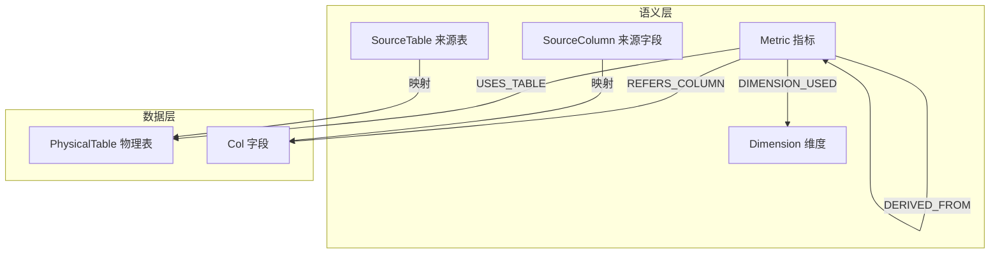
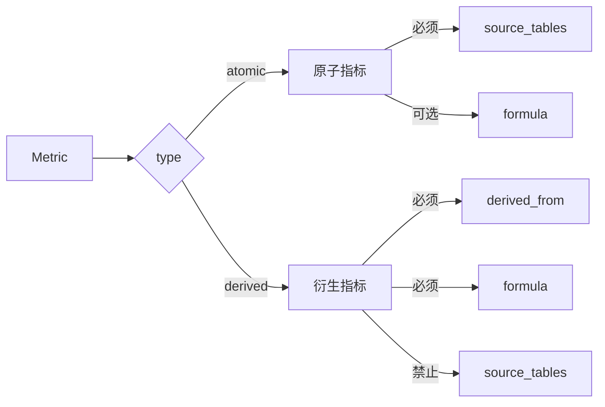
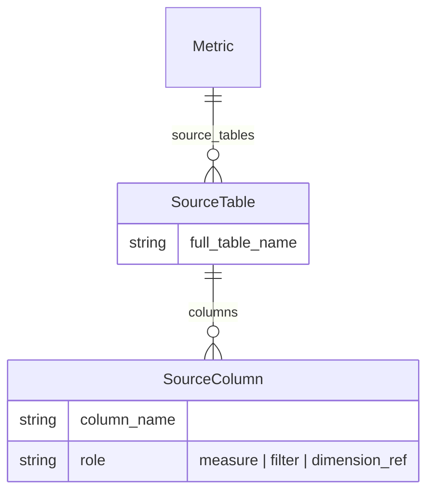
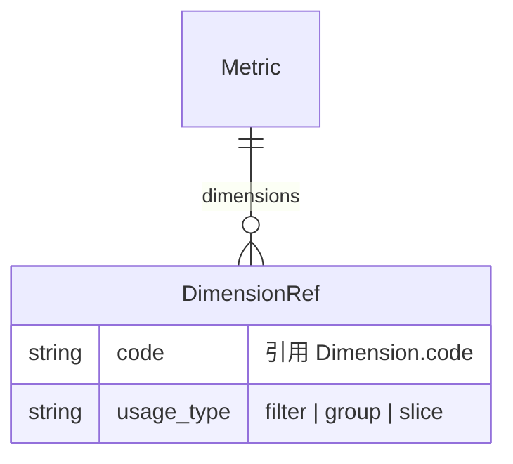
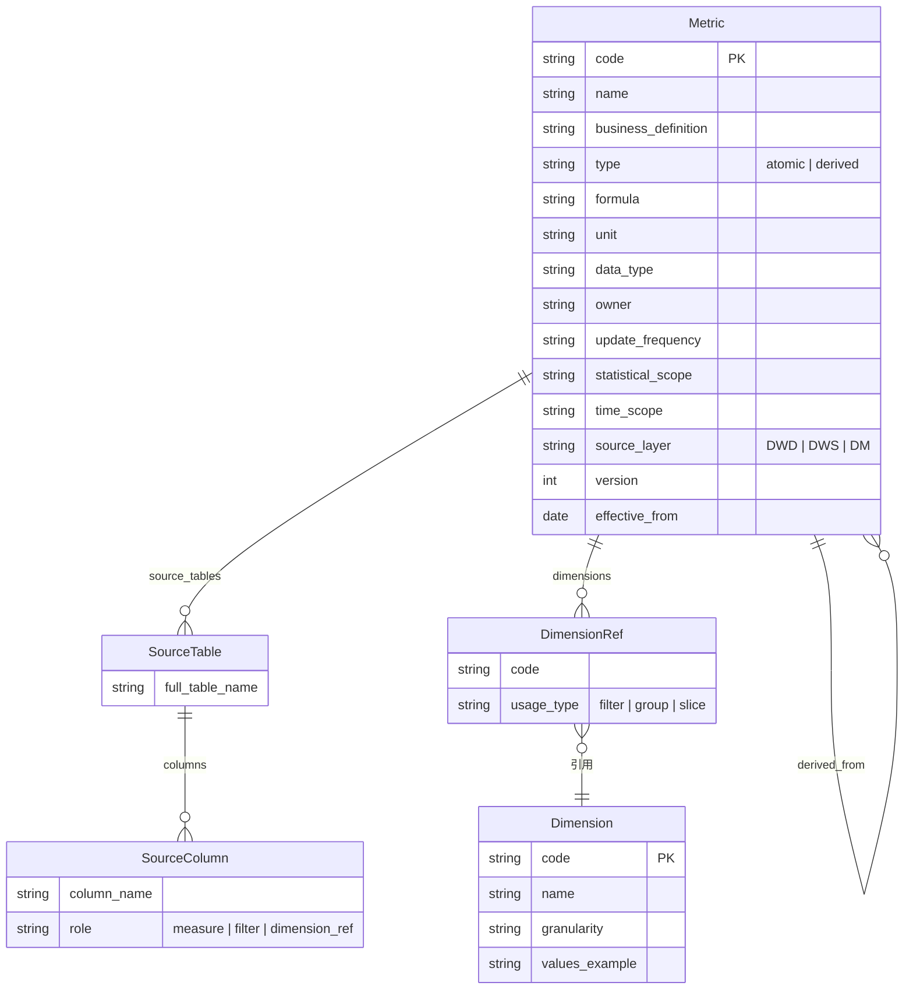
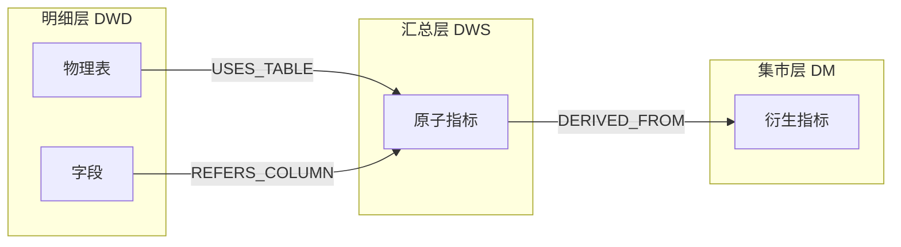

# Govio 语义层模型

基于 `metric_schema.json` 定义的指标语义层结构。

## 整体架构

## 指标分类与约束

## SourceTable 与 SourceColumn 关系

## 指标与维度引用

## 完整语义层 ER 图

## 数据血缘示意

## 约束规则

| 规则 | 说明 |
|------|------|
| atomic 指标必须声明 `source_tables` | 原子指标需要明确数据来源 |
| derived 指标必须声明 `derived_from` + `formula` | 衍生指标依赖其他指标并定义计算公式 |
| derived 指标不可声明 `source_tables` | 衍生指标的数据来源通过依赖指标间接获得 |
| `derived_from` 必须构成 DAG | 指标依赖不允许循环 |
| `source_layer` 枚举约束 | 仅允许 DWD / DWS / DM |
| `role` 枚举约束 | 字段角色仅允许 measure / filter / dimension_ref |
| `usage_type` 枚举约束 | 维度使用方式仅允许 filter / group / slice |
